# PCB-001 — Adjustable NE555 Astable LED Flasher

An adjustable, through-hole NE555 astable oscillator that flashes a red LED from a 5 V supply. The project was developed progressively through analytical design, LTspice, a Tinkercad virtual breadboard, KiCad schematic capture, two-layer PCB routing, KiCad/ngspice characterization, mechanical review, and final design-rule/parity checks.

> [!IMPORTANT]
> **Current status:** the electrical design, simulations, PCB routing, 3D assembly representation, and KiCad consistency checks are complete and documented. The final PCB DRC recorded **0 violations, 0 unconnected items, 0 schematic-parity findings, and 0 ignored tests**. This is a reviewed design/simulation milestone—not a fabricated or physically validated product.

> [!NOTE]
> **Fabrication decision:** no money is being spent on board manufacture at this stage. Gerber, drill, job, checksum, purchasing, assembly, and bench-validation activities are intentionally **deferred**. No Gerber or drill package exists in this repository.

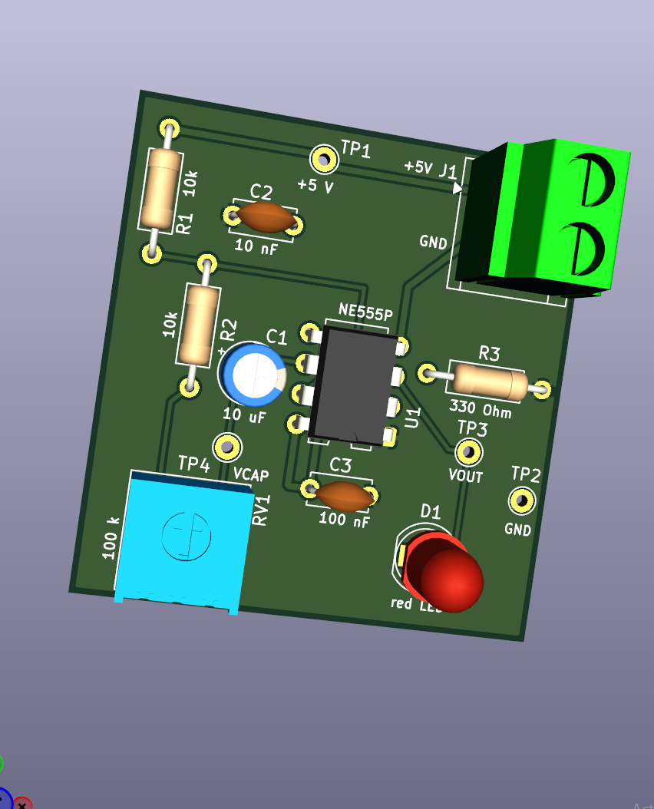

## Contents

- [Project snapshot](#project-snapshot)
- [Engineering workflow and gate status](#engineering-workflow-and-gate-status)
- [Circuit architecture](#circuit-architecture)
- [How the astable oscillator works](#how-the-astable-oscillator-works)
- [Design equations](#design-equations)
- [Progressive development record](#progressive-development-record)
- [Cross-tool verification summary](#cross-tool-verification-summary)
- [PCB implementation](#pcb-implementation)
- [Exact component baseline](#exact-component-baseline)
- [Mechanical and silkscreen review](#mechanical-and-silkscreen-review)
- [Final verification](#final-verification)
- [Repository map](#repository-map)
- [Reproducing the work](#reproducing-the-work)
- [Known limitations and remaining gates](#known-limitations-and-remaining-gates)
- [Primary records](#primary-records)

## Project snapshot

| Item | Final recorded design |
|---|---|
| Function | Adjustable NE555 astable oscillator driving a red LED |
| Supply | 5 V DC through J1; pin 1 = +5 V, pin 2 = GND |
| Timer | Texas Instruments NE555P, PDIP-8 |
| Timing network | R1 = 10 kΩ, R2 = 10 kΩ, RV1 = 100 kΩ, C1 = 10 µF |
| Timing range | Approximately 0.63 Hz to 4.8 Hz across the potentiometer range |
| LED branch | U1 OUT → D1 red LED → R3 330 Ω → GND |
| Support capacitors | C2 = 10 nF on CONT; C3 = 100 nF across the supply |
| Test access | TP1 +5 V, TP2 GND, TP3 VOUT, TP4 VCAP |
| PCB | 38.50 mm × 40.75 mm, 2 layers, through-hole, no vias |
| Copper | 0.50 mm power/GND traces; 0.30 mm signal/timing traces; GND zones on both layers |
| Final KiCad result | DRC 0; unconnected 0; parity 0; ignored tests 0 |
| Manufacturing | Intentionally deferred; no Gerbers or drills generated |

## Engineering workflow and gate status

The repository follows a gated engineering workflow. Evidence from one stage does not automatically prove the next stage.

```mermaid
flowchart LR
    A["1. Analytical design<br/>PASS"] --> B["2. LTspice sweep<br/>PASS"]
    B --> C["3. Tinkercad breadboard<br/>PASS"]
    C --> D["4. KiCad schematic<br/>ERC/parity clean"]
    D --> E["5. PCB layout<br/>DRC clean"]
    E --> F["6. Fabrication outputs<br/>DEFERRED"]
    F --> G["7. Assembly/inspection<br/>NOT PERFORMED"]
    G --> H["8. Physical validation<br/>PENDING"]

    classDef pass fill:#d9f2df,stroke:#20834f,color:#123a24;
    classDef deferred fill:#fff2cc,stroke:#b8860b,color:#5f4700;
    classDef pending fill:#eeeeee,stroke:#777,color:#333;
    class A,B,C,D,E pass;
    class F deferred;
    class G,H pending;
```

| Gate | Evidence | Status |
|---|---|---|
| Analytical design | Standard NE555 equations and MATLAB learning model | PASS in the historical project record |
| LTspice full-range verification | Three-step `RBval` sweep, saved `.asc`, `.log`, and raw results | PASS in the historical project record |
| LED output verification | LTspice LED-current measurements | PASS in the historical project record |
| Tinkercad virtual breadboard | Corrected Arduino logger plus minimum/midpoint/maximum evidence | PASS |
| KiCad schematic review | Authoritative schematic, component metadata, ERC/parity cleanup | Complete; final parity clean |
| PCB layout review | Routed two-layer board, copper zones, mechanical review, final DRC | Complete; final DRC clean |
| KiCad transient characterization | UA555 model, timing range, LED current/voltage/power exports | Evidence recorded; not a formal requirement PASS because acceptance criteria and the exact KiCad version were not recorded before the run |
| Fabrication/assembly/physical test | No board ordered or assembled | Deferred/pending |

## Circuit architecture

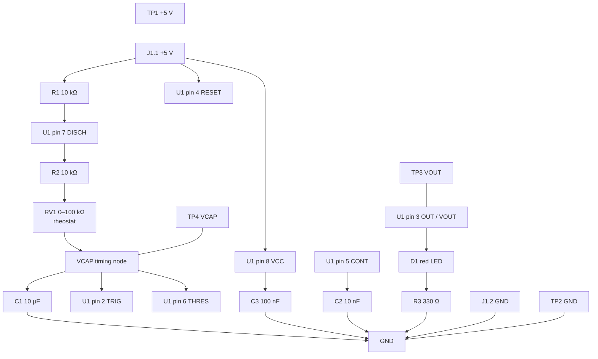

### NE555 pin map

| Pin | Name | Connection in PCB-001 |
|---:|---|---|
| 1 | GND | Ground plane and J1 pin 2 |
| 2 | TRIG | VCAP timing node |
| 3 | OUT | VOUT, TP3, and LED branch |
| 4 | RESET | +5 V |
| 5 | CONT | C2 10 nF to GND |
| 6 | THRES | VCAP timing node |
| 7 | DISCH | Junction of R1 and R2 |
| 8 | VCC | +5 V and local C3 decoupling |

## How the astable oscillator works

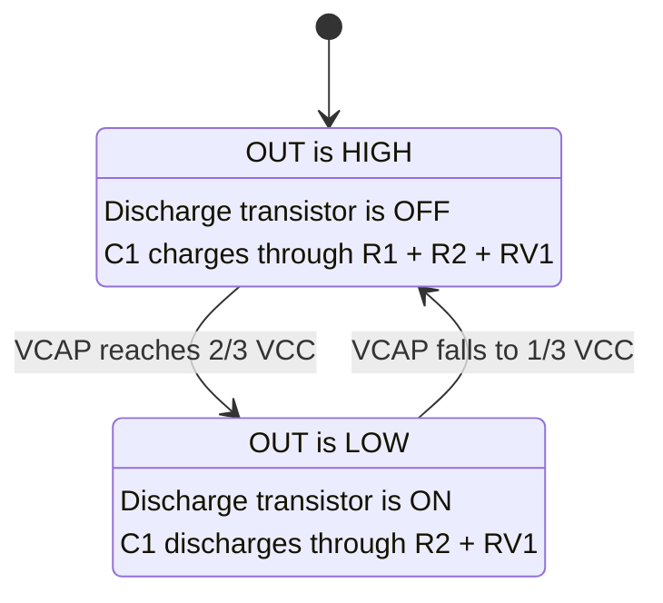

The two internal comparator thresholds are:

$$
V_{TRIG}=\frac{V_{CC}}{3}, \qquad V_{THRES}=\frac{2V_{CC}}{3}
$$

For a 5 V supply, the ideal thresholds are approximately 1.667 V and 3.333 V. The external capacitor repeatedly moves between those limits while `VOUT` toggles.

## Design equations

For the production timing network, define:

$$
R_A=R_1=10\text{ k}\Omega
$$

$$
R_B=R_2+R_{V1}
$$

$$
C=C_1=10\ \mu\text{F}
$$

The standard bipolar-555 astable approximations are:

$$
t_{HIGH}=\ln(2)(R_A+R_B)C
$$

$$
t_{LOW}=\ln(2)R_BC
$$

$$
T=t_{HIGH}+t_{LOW}=\ln(2)(R_A+2R_B)C
$$

$$
f=\frac{1}{T}
$$

$$
D=\frac{t_{HIGH}}{T}=\frac{R_A+R_B}{R_A+2R_B}
$$

The idealized production-network range is therefore:

| RV1 setting | Effective R_B | Ideal t_HIGH | Ideal t_LOW | Ideal period | Ideal frequency | Ideal duty |
|---:|---:|---:|---:|---:|---:|---:|
| 0 Ω | 10 kΩ | 0.139 s | 0.069 s | 0.208 s | 4.81 Hz | 66.7% |
| 50 kΩ | 60 kΩ | 0.485 s | 0.416 s | 0.901 s | 1.11 Hz | 53.8% |
| 100 kΩ | 110 kΩ | 0.832 s | 0.762 s | 1.594 s | 0.627 Hz | 52.2% |

The timing-capacitor trajectories are described by:

$$
V_C(t)=V_{CC}-(V_{CC}-V_{C0})e^{-t/((R_A+R_B)C)} \quad \text{(charging)}
$$

$$
V_C(t)=V_{C0}e^{-t/(R_BC)} \quad \text{(discharging)}
$$

For the loaded LED branch:

$$
I_{LED}\approx\frac{V_{OUT,H}-V_F}{R_3}
$$

Using the recorded KiCad-model values:

$$
I_{LED}\approx\frac{3.62\text{ V}-1.90\text{ V}}{330\ \Omega}=5.21\text{ mA}
$$

and:

$$
P_{R3}=I_{LED}^{2}R_3\approx(5.20\text{ mA})^2(330\ \Omega)=8.92\text{ mW}
$$

This is far below the controlled 0.25 W resistor rating in the simulation model. It is not a substitute for a physical temperature or tolerance test.

## Progressive development record

### 1. Analytical learning model

The project began with the standard NE555 astable equations and a MATLAB visualization of the charge/discharge cycle. The script animates `VCAP`, `VOUT`, the comparator thresholds, and the changing discharge state.

- Source: [`simulation/matlab/ne555_astable_cycle_animation.m`](simulation/matlab/ne555_astable_cycle_animation.m)
- Purpose: understand timing-node behaviour and establish expected waveform shape.
- Boundary: the MATLAB script is a conceptual learning model; the final production topology and simulator results remain the controlled evidence.

### 2. LTspice three-point sweep

The LTspice source swept the effective timing resistance at 10 kΩ, 60 kΩ, and 110 kΩ. The saved LTspice log reports:

| Effective R_B | Period | Frequency | t_HIGH | t_LOW | Duty | VCAP min/max | Peak LED current |
|---:|---:|---:|---:|---:|---:|---:|---:|
| 10 kΩ | 0.20835 s | 4.7995 Hz | 0.13882 s | 0.06953 s | 66.63% | 1.666/3.334 V | 9.005 mA |
| 60 kΩ | 0.90289 s | 1.1076 Hz | 0.48592 s | 0.41696 s | 53.82% | 1.666/3.334 V | 9.006 mA |
| 110 kΩ | 1.59743 s | 0.6260 Hz | 0.83311 s | 0.76432 s | 52.15% | 1.666/3.334 V | 9.006 mA |

Primary LTspice artifacts:

- [`simulation/ltspice/pcb001_ne555_astable.asc`](simulation/ltspice/pcb001_ne555_astable.asc)
- [`simulation/ltspice/pcb001_ne555_astable.log`](simulation/ltspice/pcb001_ne555_astable.log)
- saved `.raw` and operating-point evidence in the same directory.

### 3. Tinkercad virtual breadboard

The design was translated into a live virtual breadboard to verify practical pin mapping, potentiometer wiring, polarity, observability, and minimum/midpoint/maximum operation.

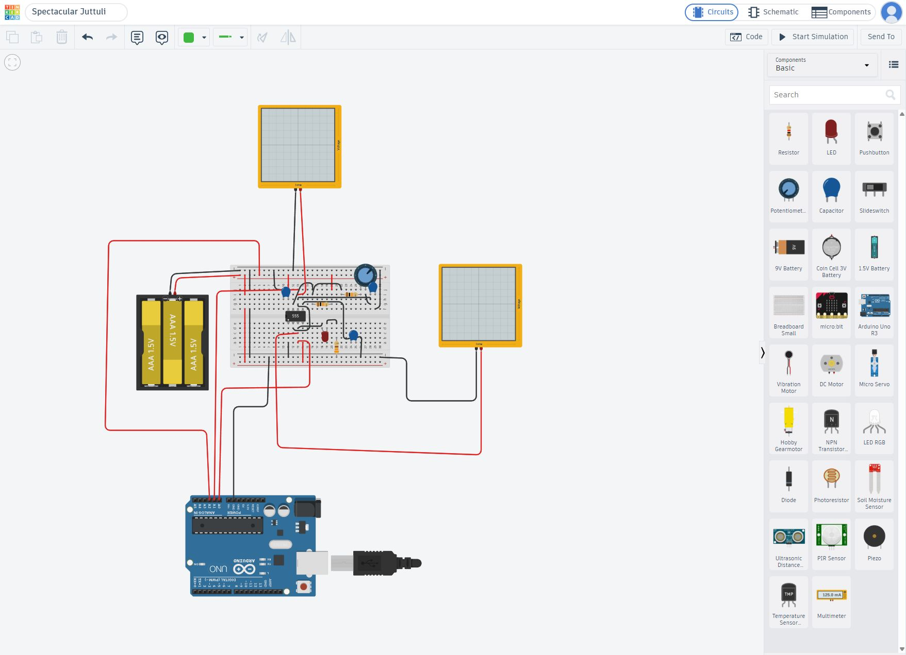

An Arduino Uno R3 logger sampled the virtual circuit every 10 ms for 8 s. The logger was later corrected so that only complete `RISE → FALL → RISE` cycles enter the averages; partial boundary cycles are excluded.

| Potentiometer | Complete cycles | Period | Frequency | Duty | VCAP range | Average VCC |
|---|---:|---:|---:|---:|---:|---:|
| Minimum | 37 | 207.838 ms | 4.8114 Hz | 66.567% | 1.5005–2.9912 V | 4.4900 V |
| Midpoint | 8 | 901.250 ms | 1.1096 Hz | 53.398% | 1.5005–2.9912 V | 4.4913 V |
| Maximum | 4 | 1597.500 ms | 0.6260 Hz | 51.487% | 1.5005–2.9912 V | 4.4916 V |

The corrected three-point Tinkercad record is marked PASS in [`simulation/tinkercad/docs/verification-summary.md`](simulation/tinkercad/docs/verification-summary.md).

### 4. KiCad production schematic

KiCad became the authoritative schematic and PCB source. The schematic includes power flags, the NE555 timing network, decoupling, LED branch, connector, and four test points.

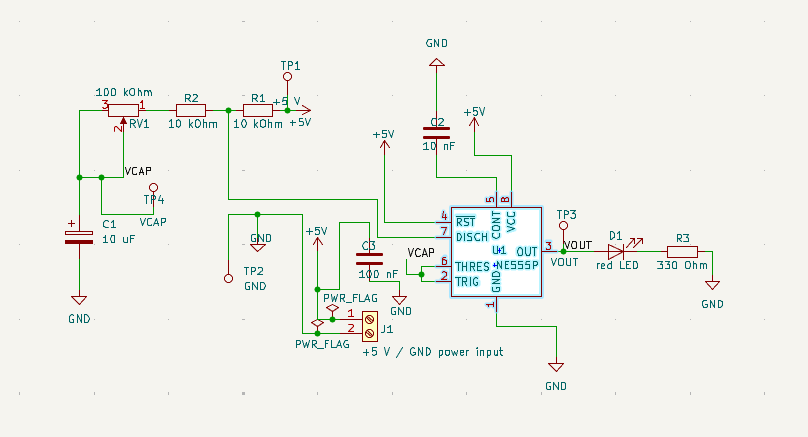

Work completed during schematic cleanup included:

- confirming the LED current path and diode orientation;
- resolving footprint/symbol filters and parity warnings;
- normalizing R1, R2, and RV1 value strings between schematic and PCB;
- recording exact manufacturer, MPN, and datasheet metadata;
- linking U1 to the external `UA555` subcircuit model;
- preserving the production schematic separately from the simulation-only schematic.

### 5. UA555 simulation-model integration

KiCad did not provide a suitable bundled 555 macromodel for this workflow. The project therefore uses [`kicad/models/uA555.sub`](kicad/models/uA555.sub), with subcircuit `UA555` and direct symbol-to-model pin mapping:

```text
1=GND  2=TRIG  3=OUT  4=RESET
5=CONT 6=THRES 7=DISCH 8=VCC
```

The simulation schematic uses `R4` as a simulation-only substitute for RV1. `R4` was evaluated at 1 Ω, 50 kΩ, and 100 kΩ; it is not a fitted PCB component and is excluded from the production BOM.

### 6. PCB placement and routing

Routing was completed incrementally around the most sensitive and constrained paths:

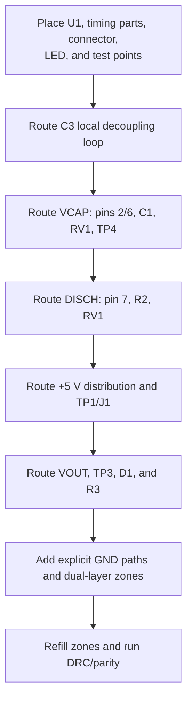

Critical decisions:

- **C3 loop:** U1 pin 8 to C3 pad 1 and U1 pin 1 to C3 pad 2 were kept compact and close to the DIP.
- **VCAP:** U1 pins 2 and 6, C1 positive, TP4, and RV1 were concentrated into a short timing-node region.
- **Layer crossings:** F.Cu and B.Cu traces may cross without electrical contact. Through-hole pads provide layer access, so no vias were needed.
- **Widths:** 0.50 mm was used for +5 V and explicit GND traces; 0.30 mm was used for timing and ordinary signals.
- **Ground:** GND zones were added on F.Cu and B.Cu with thermal reliefs and island removal.

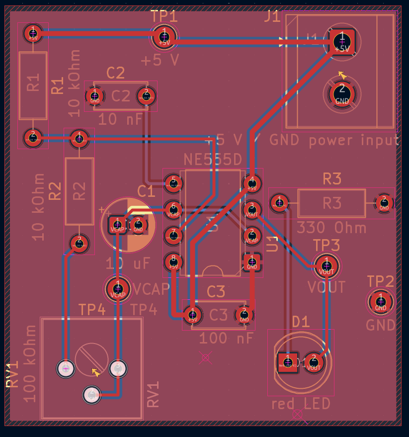

### 7. KiCad timing and loaded-LED characterization

The KiCad transient runs used 5 V, PSpice/LTspice compatibility, and a 100 µs time step/maximum step. Timing-range runs excluded D1 and R3; the loaded run restored the LED branch at the 50 kΩ setting.

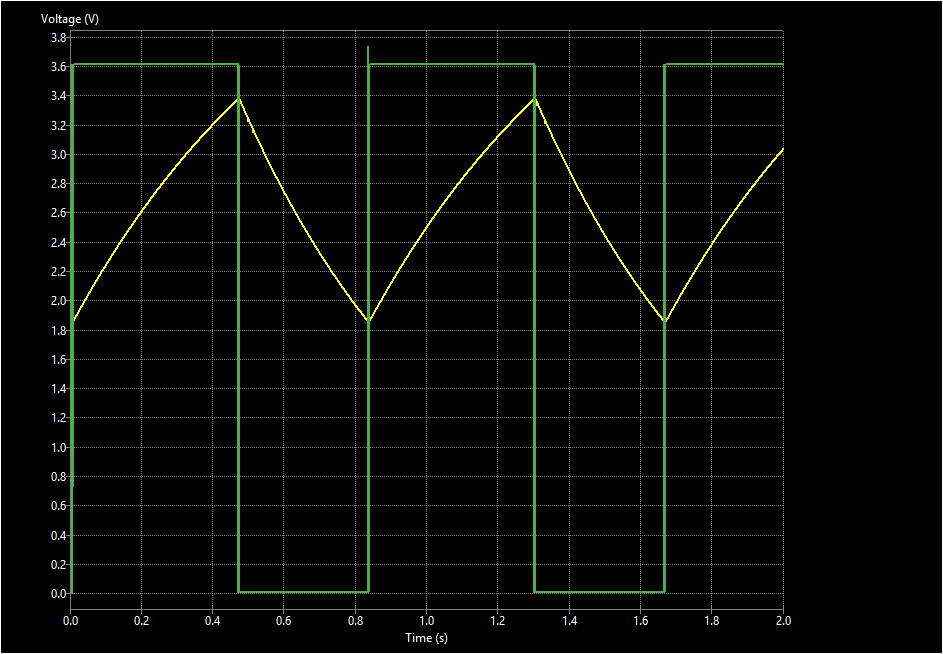

| R4 simulation setting | Period | Frequency | High | Low | Duty | VCAP range |
|---:|---:|---:|---:|---:|---:|---:|
| 1 Ω | 0.197 s | 5.08 Hz | 0.127 s | 0.070 s | 64.5% | about 1.85–3.38 V |
| 50 kΩ | 0.845 s | 1.18 Hz | 0.443 s | 0.402 s | 52.4% | about 1.85–3.38 V |
| 100 kΩ | 1.45 s | 0.690 Hz | 0.767 s | 0.683 s | 52.9% | about 1.85–3.38 V |

The loaded LED branch at 50 kΩ produced approximately 3.62 V VOUT high, 1.90 V LED forward drop, 5.20 mA LED current, and 8.92 mW steady R3 power. The maximum saved R3 transient power was 10.19 mW.

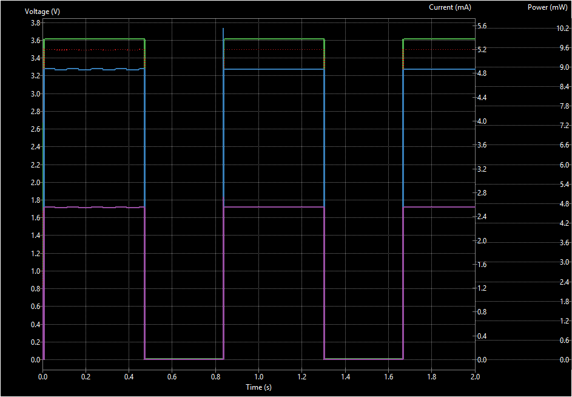

Every plot has a matching CSV export under [`simulation/kicad/schematic_simulation_response_plots/`](simulation/kicad/schematic_simulation_response_plots/).

### 8. Production definition, 3D models, and final audit

The project then moved from electrical completion to production-focused definition without generating manufacturing outputs:

- exact manufacturer part numbers and datasheets were recorded;
- a controlled production BOM and bare-board profile were created;
- manufacturer STEP models were assigned for Bourns RV1 and Same Sky J1;
- RV1 pin/body alignment and J1 wire-entry orientation were corrected;
- +5V/GND/VOUT/VCAP functional silkscreen labels were added;
- the completed board was visually reviewed from the front and back;
- KiCad DRC and schematic parity were rerun to a clean state.

## Cross-tool verification summary

The three major electrical models agree on the intended adjustable trend and threshold behaviour. Differences reflect model implementation, supply assumptions, measurement methods, and the generic KiCad LED/model setup.

| Setting | Ideal equation | LTspice | Tinkercad corrected logger | KiCad UA555 characterization |
|---|---:|---:|---:|---:|
| Minimum | 4.81 Hz | 4.7995 Hz | 4.8114 Hz | 5.08 Hz |
| Midpoint | 1.11 Hz | 1.1076 Hz | 1.1096 Hz | 1.18 Hz |
| Maximum | 0.627 Hz | 0.6260 Hz | 0.6260 Hz | 0.690 Hz |

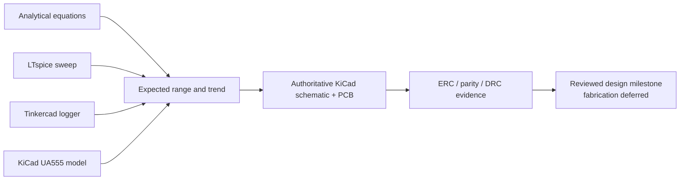

## PCB implementation

### Board and copper inventory

| Property | Recorded value |
|---|---:|
| Width | 38.50 mm |
| Height | 40.75 mm |
| Copper layers | 2 |
| F.Cu +5 V segments | 11 at 0.50 mm |
| F.Cu GND segments | 2 at 0.50 mm |
| Remaining F.Cu signal segments | 18 at 0.30 mm |
| B.Cu signal segments | 7 at 0.30 mm |
| Total routed segments | 38 |
| Vias | 0 |
| Copper zones | GND on F.Cu and B.Cu |
| Zone clearance/minimum feature | 0.25 mm / 0.25 mm |

### Routing ownership by net

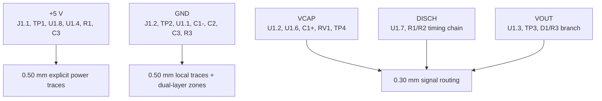

## Exact component baseline

| References | Manufacturer | Part number | Controlled purpose |
|---|---|---|---|
| U1 | Texas Instruments | `NE555P` | Bipolar PDIP-8 timer |
| RV1 | Bourns | `3386P-1-104LF` | 100 kΩ top-adjust trimmer |
| R1, R2 | YAGEO | `MFR-25FBF52-10K` | 10 kΩ, 1%, 0.25 W axial |
| R3 | YAGEO | `MFR-25FBF52-330R` | 330 Ω, 1%, 0.25 W axial |
| C1 | Panasonic Industry | `ECEA1VKA100` | 10 µF, 35 V radial electrolytic |
| C2 | Vishay BCcomponents | `K103K10X7RF53H5` | 10 nF X7R radial MLCC |
| C3 | Vishay BCcomponents | `K104K10X7RF53H5` | 100 nF X7R radial MLCC |
| D1 | Kingbright | `L-53LID` | Low-current red 5 mm LED |
| J1 | Same Sky | `TB007-508-02BE` | 2-position 5.08 mm horizontal terminal block |

The machine-readable version is [`fabrication/PCB-001-production-bom.csv`](fabrication/PCB-001-production-bom.csv). Substitutions require electrical, dimensional, polarity, footprint, and verification review.

## Mechanical and silkscreen review

The Bourns and Same Sky manufacturer STEP models are repository-local so the final board can be rendered reproducibly:

- `kicad/pcb-001-ne555/models/Bourns_3386P001XXX.stp`
- `kicad/pcb-001-ne555/models/Same_Sky_TB007-508-02BE.step`

The first assignments exposed visible model errors: RV1 pins did not coincide with the board holes, and J1's body/wire-entry direction was wrong. Footprint-level model offsets and rotations were corrected until the pins, screws, bodies, adjustment slot, and horizontal wire access aligned with the PCB.

Functional F.Silkscreen labels were added:

| Location | Label |
|---|---|
| J1 pin 1 | +5V |
| J1 pin 2 | GND |
| TP1 | +5V |
| TP2 | GND |
| TP3 | VOUT |
| TP4 | VCAP |

Mechanical observations:

- J1 is accessible at the top/right edge; its courtyard-to-edge margin is close at roughly 0.35 mm.
- TP2 is close to the right edge at roughly 0.50 mm courtyard margin.
- RV1 remains top-adjustable from the component side.
- U1 pin 1/notch, C1 positive, D1 cathode, and J1 pin 1 are identifiable.
- No mounting holes are present; any later enclosure must account for that.

## Final verification

| KiCad check | Final count | Interpretation |
|---|---:|---|
| PCB violations | 0 | Configured design rules clean |
| Unconnected items | 0 | All intended nets routed |
| Schematic parity | 0 | Schematic/footprint/value relationship synchronized |
| Ignored tests | 0 | No current DRC exceptions |

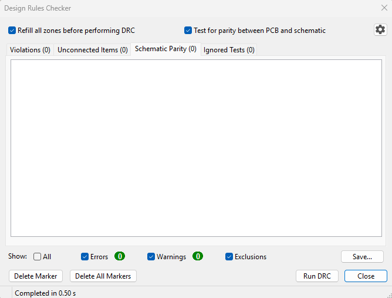

The clean DRC is evidence for the saved design state. It does not prove manufacturability at a chosen vendor, component availability, assembly quality, or physical performance.

## Fabrication decision and deferred outputs

The component definition and fabrication profile were prepared as a future planning baseline, but the project owner decided not to spend money on fabrication now.

| Output/gate | State | Reason |
|---|---|---|
| Gerber X2 plots | Not generated | Fabrication intentionally deferred |
| Excellon drill/drill map | Not generated | Fabrication intentionally deferred |
| Gerber job/checksum archive | Not generated | No release package requested |
| Independent Gerber/drill inspection | Not performed | Requires generated outputs |
| Fabricator electrical test | Not performed | No manufacturing order |
| Assembly and visual inspection | Not performed | No physical board |
| Powered bench validation | Not performed | No physical board |
| Physical requirement closure | Pending | Simulation and DRC are not substitutes |

If fabrication is reconsidered, start from the release gates in [`fabrication/PCB-001-fabrication-profile.md`](fabrication/PCB-001-fabrication-profile.md); do not assume this repository is already a released manufacturing package.

## Repository map

```text
.
├── README.md
├── AGENTS.md
├── docs/
│   ├── images/                         # README engineering evidence
│   ├── datasheets/                     # controlled reference PDFs
│   ├── test-report.md                  # KiCad simulation record
│   └── PCB-001_KiCad_Simulation_Results_2026-08-21.docx
├── fabrication/
│   ├── PCB-001-production-bom.csv
│   └── PCB-001-fabrication-profile.md
├── kicad/
│   ├── models/uA555.sub
│   ├── evidence/
│   └── pcb-001-ne555/
│       ├── pcb-001-ne555-placement-modified.kicad_pro
│       ├── pcb-001-ne555-placement-modified.kicad_sch
│       ├── pcb-001-ne555-placement-modified.kicad_pcb
│       └── models/                      # manufacturer STEP files
├── simulation/
│   ├── matlab/                          # analytical animation
│   ├── ltspice/                         # precision sweep source/results
│   ├── tinkercad/                       # breadboard docs, logger, evidence
│   └── kicad/
│       ├── simulation_schematic/
│       ├── workbook/
│       ├── schematic_simulation_response_plots/
│       └── schematic_simulation_response_plots.zip
└── worklogs/
    ├── 2026-08-13_2113/                 # earlier engineering records
    └── 2026-08-21_1935/                 # detailed final progress report
```

## Reproducing the work

### Open the authoritative KiCad design

1. Open [`kicad/pcb-001-ne555/pcb-001-ne555-placement-modified.kicad_pro`](kicad/pcb-001-ne555/pcb-001-ne555-placement-modified.kicad_pro).
2. Review the authoritative schematic and PCB in the same directory.
3. Refill copper zones before DRC.
4. Run ERC in the Schematic Editor.
5. Run PCB DRC with schematic parity enabled.
6. Confirm `0/0/0/0` before treating the saved design as equivalent to the documented final state.

### Reproduce the KiCad simulation evidence

1. Open [`simulation/kicad/simulation_schematic/pcb-001-ne555.kicad_sch`](simulation/kicad/simulation_schematic/pcb-001-ne555.kicad_sch).
2. Confirm that U1 uses `UA555` from `kicad/models/uA555.sub` and that pins 1–8 map directly.
3. Use transient analysis with PSpice/LTspice compatibility.
4. Use 5 V, a 100 µs time step, and a 100 µs maximum step.
5. For timing characterization, exclude D1 and R3 and set R4 to 1 Ω, 50 kΩ, or 100 kΩ.
6. Use 2 s for the 1 Ω/50 kΩ cases and 10 s for the 100 kΩ case.
7. For the loaded LED case, restore D1 and R3, set R4 to 50 kΩ, use 2 s, and save voltages, currents, and power.
8. The retained simulator workbook is [`simulation/kicad/workbook/pcb-001-ne555.wbk`](simulation/kicad/workbook/pcb-001-ne555.wbk).

### Reproduce LTspice

1. Open `simulation/ltspice/pcb001_ne555_astable.asc` in LTspice.
2. Run the transient sweep.
3. Review period, frequency, duty, VCAP limits, VOUT levels, and LED current for every `RBval` step.
4. Compare against `simulation/ltspice/pcb001_ne555_astable.log` without hand-editing generated raw/log/net files.

### Reproduce the analytical visualization

With MATLAB available:

```matlab
run('simulation/matlab/ne555_astable_cycle_animation.m')
```

### Review Tinkercad evidence

The live project is cloud-hosted; reproducible repository artifacts are under `simulation/tinkercad/`. Start with:

- [`simulation/tinkercad/README.md`](simulation/tinkercad/README.md)
- [`simulation/tinkercad/docs/circuit-connections.md`](simulation/tinkercad/docs/circuit-connections.md)
- [`simulation/tinkercad/docs/verification-summary.md`](simulation/tinkercad/docs/verification-summary.md)
- [`simulation/tinkercad/arduino/pcb001_ne555_logger.ino`](simulation/tinkercad/arduino/pcb001_ne555_logger.ino)

## Known limitations and remaining gates

- The exact KiCad application version used for the final simulator/DRC runs was not recorded.
- The KiCad LED model is an adjusted generic diode (`is = 1e-18 A`, `rs = 5 Ω`, `n = 2`), not a manufacturer-specific Kingbright macromodel.
- Formal acceptance criteria were not recorded before the KiCad simulation runs, so those observations are not labelled requirement PASS results.
- No Monte Carlo/tolerance, temperature, aging, or supply-variation analysis is recorded for the final KiCad model.
- Manufacturer/model switching spikes visible in some UA555 plots are treated as numerical/model behaviour, not predicted hardware overshoot.
- No Gerber/drill outputs, independent CAM inspection, procurement check, assembly, or bench measurements exist.
- Final component values and geometry must be rechecked if any substitute part is proposed.
- The board has no mounting holes.
- A fresh ERC/DRC/parity run is required after any future metadata, schematic, footprint, routing, zone, or silkscreen change.

## Primary records

| Record | Purpose |
|---|---|
| [`docs/test-report.md`](docs/test-report.md) | KiCad simulation configuration and numeric results |
| [`docs/PCB-001_KiCad_Simulation_Results_2026-08-21.docx`](docs/PCB-001_KiCad_Simulation_Results_2026-08-21.docx) | Concise illustrated simulation report |
| [`worklogs/2026-08-21_1935/PCB-001_Engineering_Progress_Report_2026-08-21.docx`](worklogs/2026-08-21_1935/PCB-001_Engineering_Progress_Report_2026-08-21.docx) | Detailed 14-page engineering progress report |
| [`fabrication/PCB-001-production-bom.csv`](fabrication/PCB-001-production-bom.csv) | Machine-readable exact component baseline |
| [`fabrication/PCB-001-fabrication-profile.md`](fabrication/PCB-001-fabrication-profile.md) | Future board/assembly definition and release gates |
| [`simulation/tinkercad/docs/verification-summary.md`](simulation/tinkercad/docs/verification-summary.md) | Corrected virtual-breadboard verification |
| [`simulation/ltspice/pcb001_ne555_astable.log`](simulation/ltspice/pcb001_ne555_astable.log) | LTspice numerical measurement record |
| [`simulation/kicad/schematic_simulation_response_plots/`](simulation/kicad/schematic_simulation_response_plots/) | KiCad PNG and CSV evidence |

## Chronology

| Date | Milestone |
|---|---|
| 2026-08-13 to 2026-08-14 | Analytical design, LTspice, initial documentation, and Tinkercad inspection records established |
| 2026-08-15 | Corrected Arduino logger and minimum/midpoint/maximum Tinkercad dynamic verification recorded |
| 2026-08-15 to 2026-08-16 | KiCad schematic and PCB project developed; midpoint transient evidence retained |
| 2026-08-21 | Routing completion, parity/footprint cleanup, dual-layer GND zones, UA555 integration, timing and LED simulations, PNG/CSV exports, Word reports, exact BOM/fabrication profile, manufacturer 3D-model correction, silkscreen labelling, mechanical review, and final clean DRC |
| 2026-08-21 | Fabrication and Gerber generation explicitly deferred by project decision |

---

PCB-001 is retained as a complete learning, simulation, schematic, and PCB-layout milestone. Any future fabrication effort should resume at the controlled release-gate checklist rather than treating the current repository as manufacturing-released.
